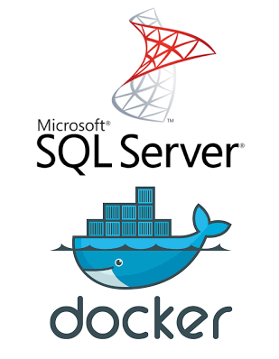

# Secure Deployment of Microsoft SQL Server 2017 with Docker Compose: A Step-by-Step Guide


## Description 
In this article, we'll delve into deploying Microsoft SQL Server 2017 on Docker using Docker Compose. We'll also discuss implementing a Bash script for securely managing the server password and initiating the deployment process.

## Why using docker compose to run Microsoft Server

Using Docker Compose to run Microsoft SQL Server offers several advantages. Firstly, it ensures traceability and consistency by allowing you to define your SQL Server container and its dependencies in a single YAML file. This simplifies deployment and maintenance, as all configuration options are centralized and easy to manage. Additionally, Docker Compose enables you to leverage infrastructure as code principles, making it straightforward to version control and automate your SQL Server deployments. Lastly, Docker Compose provides built-in support for environment variables, enhancing security by enabling secure management of sensitive information like passwords. Overall, Docker Compose offers a streamlined and efficient approach to deploying and managing Microsoft SQL Server in a Dockerized environment.

## Prerequisites
- Linux VM
- Docker installed 
- Docker compose installed

## Step-by-Step Deployment Guide:

In this section, we'll outline the sequence of actions required to deploy Microsoft SQL Server using Docker Compose

### Create bash script to manage deployment process : 
In this step, we'll craft a sample bash script to enhance the security of Microsoft Server password management and streamline the deployment process.
- **This is the bash script :** 
```
#!/bin/bash

set -x
#--------------------->  Deploy process
# Get The password : 
echo "Enter your mssql server password !"
read -s MSSQL_PASS

# Deploy the server using docker compose command 
MSSQL_PASS="$MSSQL_PASS" docker compose -f ./docker-compose.yaml up -d

```

### Create docker compose file : 
In this step we will create docker compose file that will contain configuration to deploy Microsoft SqlServer on docker .

**Below is the docker compose file :**
```
version: '3.8'
services:
  mssql:
    image: mcr.microsoft.com/mssql/server:2017-latest
    container_name: mssql
    restart: always
    environment:
      - ACCEPT_EULA=Y
      - MSSQL_SA_PASSWORD=${MSSQL_PASS}
    ports:
      - 1433:1433
    volumes:
      - /var/opt/mssql:/var/opt/mssql

```
**Explain Configuration:**

**1. Environment :**
- ACCEPT_EULA=Y : This option is set to Y value to confirm your acceptance of the End-User Licensing Agreement. 
- MSSQL_SA_PASSWORD=${MSSQL_PASS} : This parameter represents the password for the MSSQL Server, which will be set to the value provided by the user.

**2. Volumes :**
- /var/opt/mssql:/var/opt/mssql : configures a volume mount, ensuring that data stored by the MSSQL Server is persisted on the host system at /var/opt/mssql. This approach facilitates data management and ensures that important information remains accessible even if the server container is restarted or recreated.

### Initiating the Deployment Process:
In this stage, we will commence the deployment process by executing the previously created bash script. This script prompts the user for the necessary password and then executes the Docker Compose command, initiating the deployment of Microsoft Server 2017 on Docker.

- **Command to execute bash script :**
```
bash /path/to/scrit.sh

```